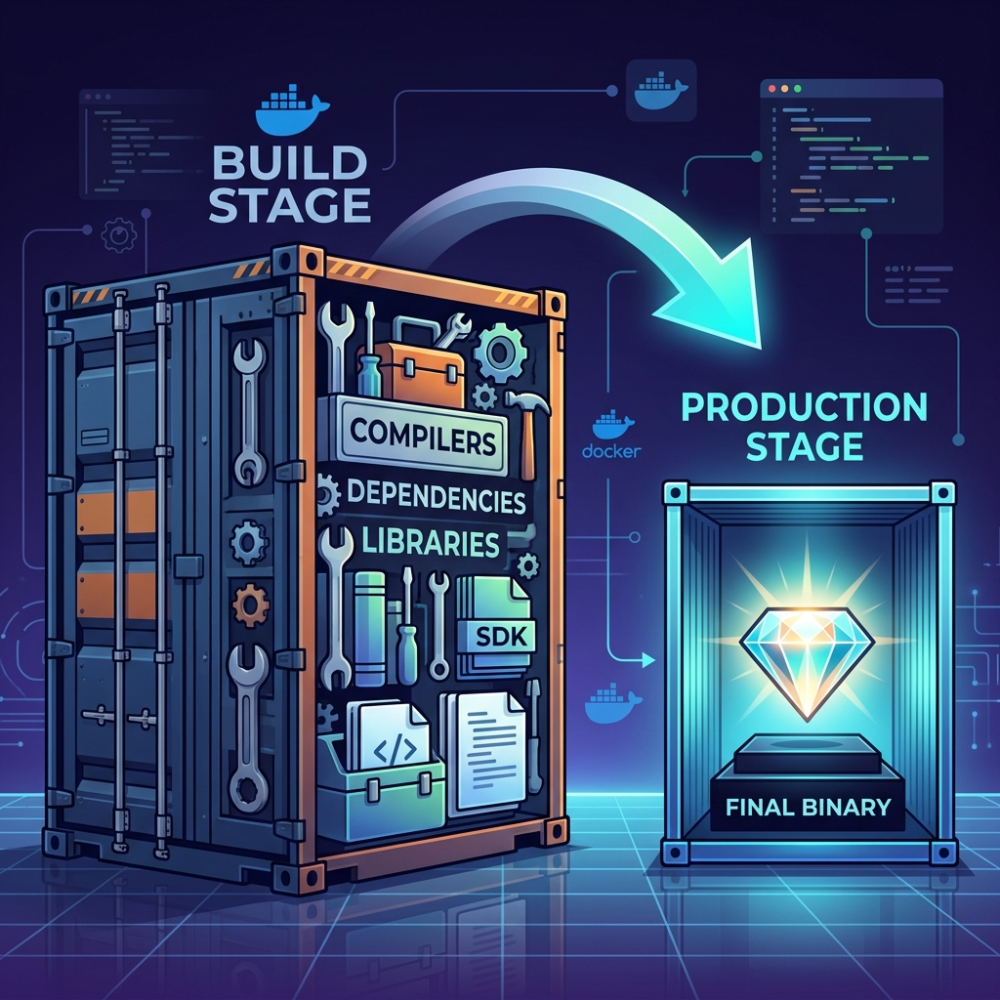

# 🐋 Multi-Stage Docker Builds: The Ultimate Optimization

Welcome to the world of high-performance Docker images! If you've ever wondered why your simple "Hello World" app is taking up 800MB of space, you're in the right place.

---

## 🌟 What is a Multi-Stage Dockerfile?

A **Multi-stage Dockerfile** is a clever way to build small, secure, and efficient Docker images. In a standard Dockerfile, every instruction adds a new layer, and everything you do (installing compilers, downloading dependencies) stays in the final image.

With **Multi-stage**, you use multiple `FROM` statements. Each `FROM` starts a fresh stage. You can "borrow" files from previous stages and leave the "garbage" (compilers, source code, build tools) behind.



### 🏗️ How it Works (The "Kitchen" Analogy)
Think of a multi-stage build like a professional kitchen:
1.  **Stage 1 (The Prep Station):** You have all the knives, peelers, and bulky machines to prepare the ingredients.
2.  **Stage 2 (The Serving Plate):** You take *only* the finished dish and put it on a clean plate to serve the customer. You don't bring the peelers and the bulky machines to the customer's table!

---

## 🚀 Why Use Multi-Stage?

| Feature | Standard Build | Multi-Stage Build |
| :--- | :--- | :--- |
| **Image Size** | Massive (Includes tools) | Tiny (Only app binary) |
| **Security** | Lower (Many attack vectors) | Higher (Minimalist) |
| **Build Speed** | Slower (Cached layers help) | Fast & Efficient |
| **CI/CD** | Complex file handling | Simple & Integrated |

---

## 📁 Reference: Our Example Folders

We have curated examples for different programming languages. Here is how they leverage Multi-stage builds:

### 1. `go-app` 🐹
*   **What's inside:** A simple Go web server.
*   **The Problem:** The `golang` image is ~300MB.
*   **The Fix:** Build the Go binary in the first stage. Copy the binary to a `scratch` or `alpine` image in the second stage.
*   **Result:** A **5MB** image that runs instantly.

### 2. `java-maven-app` ☕
*   **What's inside:** A Maven-based Java application.
*   **The Problem:** You need the full JDK and Maven (~500MB) to build, but only a JRE to run.
*   **The Fix:** Use a Maven stage to create the `.jar`, then copy the `.jar` to a lightweight OpenJDK JRE image.

### 3. `react-app` ⚛️
*   **What's inside:** A modern frontend application.
*   **The Problem:** Node.js is needed to build the app, but not to serve it.
*   **The Fix:** Use a Node stage to run `npm run build`. Copy the resulting `dist/` folder to an `Nginx` stage.
*   **Result:** A super-fast web server serving static files without the Node overhead.

### 4. `node-app` 🟢
*   **What's inside:** A backend API.
*   **The Fix:** Stage 1 installs all dependencies (including dev tools like TypeScript). Stage 2 only copies the compiled JS and production `node_modules`.

### 5. `python-app` 🐍
*   **What's inside:** A Python script with dependencies.
*   **The Fix:** Use one stage to build complex C-extensions or wheels, and another stage to just run the code with a clean Python environment.

---

## 🛠️ Summary of the Pattern

```dockerfile
# STAGE 1: Build
FROM image-with-tools AS builder
WORKDIR /app
COPY . .
RUN build-my-app

# STAGE 2: Production
FROM slim-runtime-image
WORKDIR /app
COPY --from=builder /app/output .
CMD ["./run-my-app"]
```

> [!TIP]
> Always name your stages using `AS name` to make the `COPY --from=name` part readable and maintainable!
